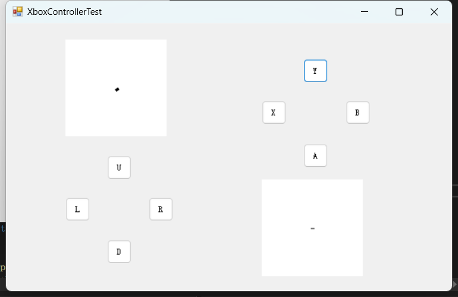

# GouChen

一个简洁便利的地面站，好用易上手。

# 勾陈/**UAV-ground-station**

用好工具，S3赛季当后排输出。

## 当前工作

手柄对调 - 完成 - 功能放在菜单栏的setting中/ -需要加入死区

下一步 研究接收机/计划使用矩阵天线

图传和数传解耦
天空端： 
飞控 +   800M或2.4G 回传天线
图传 +   5.8G 回传天线

地面站：
接收机 + 21db大平板天线

## 项目环境

**用winform，不考虑兼容性，**

**手柄选用xbox手柄**

## **计划步骤**

* **\* 1.搭建可视化桌面应用程序**
* **\* 2.在该地面站上部署固定翼的飞控调参**
* **\* 3.地面站和手柄的通信**
* **\* 4.地面站刷写飞控程序**
* **\* 5.多旋翼等其他机型的扩展**
* **\* 6.集群无人机的扩展**

### 地面站预计划功能子项

1. **飞行器姿态控制**：手动/自动
2. **有效载荷控制与显示**：关键参数显示/当前速度/位置坐标/剩余电量/预估航行时间等
3. **通信功能**：手动控制/实时图传/自动控制
4. **任务规划与监控**：标定飞行路线/自动巡航/定点绕飞/标定地图参数
5. **数据处理功能**：地图数据、图像数据、传感器数据等，进行处理和保存。

### 飞控计划功能子项

1. **主控芯片选型**
2. **框架选型**
3. **算法选择/自稳 定高 定向 返航 航点飞行 盘旋 巡航**
4. **初代设计**

